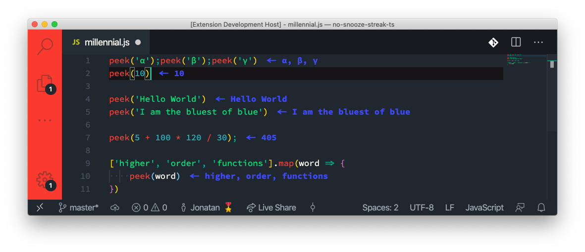

# Millennial Mode for VSCode
A REPL gives you immediate feedback and deeply introspective capabilities. Exploring concepts,
playing around, experimenting, challenging the tiniest of assumptions, poking at your own code and
that of others to get a feel for it. All of these are things that a REPL excels at.

An editor, on the other hand, has syntax highlighting and more powerful editing capabilites.

This extension gives you both. An editor inside a REPL. Or vice versa. Either will do.

## Features
Create an immediately executing JavaScript file with `"Open Millennial Mode"` editor.  
Change the `peek` styling with `setPeekedValuesColour`.

<!-- $REPL \cup EDITOR = MILLENNIAL MODE$ -->

## Known Issues
See the `Issues` section

Please feel free to submit your own issues for bugs or missing features.

## Anticipated Features
The following features are in the works and should be anticipated for upcoming versions.
- TypeScript
- Proper `require` support

**Enjoy!**
